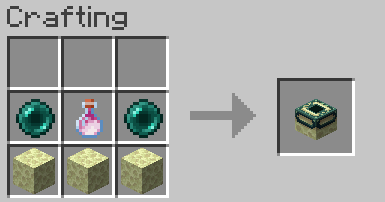
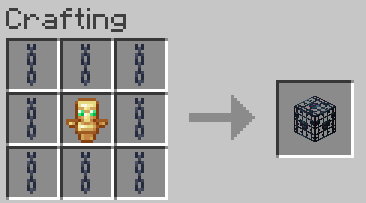

# Mysticat's Extra Vanilla Receipes
## General informations
* Mode created by Mysticat (Give him a coffee!)
* Video link : https://youtu.be/DDsLZC7V-M4
* Download link : https://www.planetminecraft.com/data-pack/mysticat-s-extra-vanilla-recipes/
* This tiny documentation is by Leikt
Let's dive into these receipes!

## Receipes
### Glow powder

**Tool:** Crafting table

**Ingredients:** x1 Glowberry

### Glow lichen

**Tool:** Crafting table

**Ingredients:** x1 Glowstone Powder, x1 Vine

### Glow ink sac

**Tool:** Crafting table

**Ingredients:** x1 Glowstone Powder, x1 Ink Sac

### Bottle o' Enchanting

**Tool:** Crafting Table

**Ingredients:** x1 Splash Water Bottle, x1 Ghast Tear, x1 Dragon's Breath

### Totem of Undying

**Tool:** Crafting Table

**Ingredients:** x1 Emerald Block, x4 Gold Block, x4 Blaze Powder

### Chainmail Helmet

**Tool:** Crafting Table

**Ingredients:** x5 Chain

### Chainmail Chestplate

**Tool:** Crafting Table

**Ingredients:** x8 Chain

### Chainmail Leggings

**Tool:** Crafting Table

**Ingredients:** x7 Chain

### Chainmail Boots

**Tool:** Crafting Table

**Ingredients:** x4 Chain

### Name Tag

**Tool:** Crafting Table

**Ingredients:** x1 String, x1 Paper, x1 Ink Sac

### Trident

**Tool:** Crafting Table

**Ingredients:** x3 Iron Ingot, x2 Prismarine Shard

### Leather Horse Armor

**Tool:** Crafting Table

**Ingredients:** x7 Leather

### Iron Horse Armor

**Tool:** Crafting Table

**Ingredients:** x1 Leather, x6 Iron Ingot

### Diamond Horse Armor

**Tool:** Crafting Table

**Ingredients:** x1 Leather, x6 Diamond

### Saddle

**Tool:** Crafting Table

**Ingredients:** x3 Leather, x1 String, x1 Iron Ingot

### Crying Obsidian

**Tool:** Crafting Table

**Ingredients:** x8 Obsidian, x1 Ghast Tear

### Magma Block

**Tool:** Crafting Table

**Ingredients:** x1 Lava Bucket, x1 Netherack

### Brown Mushroom Block

**Tool:** Crafting Table

**Ingredients:** x4 Brown Mushroom

### Red Mushroom Block

**Tool:** Crafting Table

**Ingredients:** x4 Red Mushroom

### Mushroom Stem

**Tool:** Crafting Table

**Ingredients:** x2 Red Mushroom, x2 Brown Mushroom

### Shroomlight

**Tool:** Crafting Table

**Ingredients:** x1 Mushroom Stem, x1 Glowstone

### Grass Block

**Tool:** Crafting Table

**Ingredients:** x1 Dirt, x1 Moss Carpet

### Grass Block

**Tool:** Crafting Table

**Ingredients:** x1 Dirt, x1 Moss Carpet

### Cobblestone from stone

**Tool:** Stonecutter

**Ingredients:** x1 Stone

### Concrete Powder (Any color)

**Tool:** Furnace

**Ingredients:** x1 Concrete (Any color)

### Bell

**Tool:** Crafting Table

**Ingredients:** x3 Stick, x3 Gold Ingot, x1 Gold Nugget

### Dead Bush

**Tool:** Crafting Table

**Ingredients:** x1 Oak Sapling

### String from Wool

**Tool:** Crafting Table

**Ingredients:** x1 White Wool

### Cobweb

**Tool:** Crafting Table

**Ingredients:** x5 String

### Bedrock

**Tool:** Smithing Table

**Ingredients:** x1 Obsidian, x1 Block of Netherite

### End Portal Frame

**Tool:** Crafting Table

**Ingredients:** x3 End Stone, x2 Ender Perl, x1 Dragon's Breath

**Note:** You will get an empty bottle.

### Player Head

**Tool:** Crafting Table

**Ingredients:** x1 Bottle o' Enchanting, x1 Totem of Undying

### Zombie Head

**Tool:** Crafting Table

**Ingredients:** x1 Player Head, x8 Rotten Flesh

### Skelton Head

**Tool:** Crafting Table

**Ingredients:** x1 Player Head, x8 Bone

### Spider Head

**Tool:** Crafting Table

**Ingredients:** x1 Player Head, x8 Spider Eye

**Note:** The knowledge book will transform into Spider Head.

### Zombie Spawn Egg

**Tool:** Crafting Table

**Ingredients:** x1 Zombie Head, x8 Egg

### Skelton Spawn Egg

**Tool:** Crafting Table

**Ingredients:** x1 Skelton Head, x8 Egg

### Spider Spawn Egg

**Tool:** Crafting Table

**Ingredients:** x1 Spider Head, x8 Egg

### Spawner

**Tool:** Crafting Table

**Ingredients:** x1 Totem of Undying, x8 Chain

**Note:** Right-click a spawn egg on the spawner to change the spawned mobs.

### Sculk Sensor

**Tool:** Crafting Table

**Ingredients:** x2 Glow Ink Sac, x2 Ender Perl, x1 Redstone Repeater

### Enchanted Golden Apple

**Tool:** Crafting Table

**Ingredients:** x1 Totem of Undying, x1 Apple, x1 Dragon's Breath, x6 Gold Block

### Elytra

**Tool:** Crafting Table

**Ingredients:** x1 Nether Star, x6 Phantom Membrane, x1 End Rod
